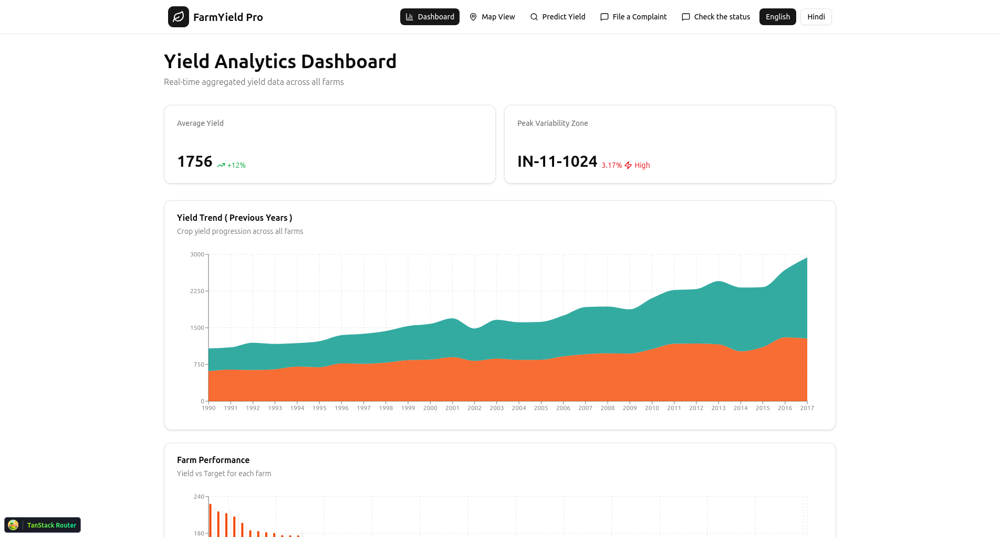

# Yield-Estimation

# Project SIH - Smart India Hackathon

This project is a full-stack web application designed to provide agricultural insights, with a focus on crop yield prediction.

## Problem Statement

Farmers and agricultural stakeholders often lack access to accurate and timely information to make informed decisions about planting, harvesting, and resource management. This can lead to suboptimal crop yields and economic losses. This project aims to bridge that gap by leveraging machine learning and geospatial data to provide actionable insights.

## Solution

Our application provides a user-friendly platform with the following features:

*   **Crop Yield Prediction:** Utilizes machine learning models to predict wheat and maize yield based on various environmental and agricultural data points.
*   **Interactive Map:** A map-based interface to visualize agricultural data and predictions for different regions.
*   **Complaint System:** A feature for users to submit complaints or feedback.
*   **Dashboard:** A dashboard to display key agricultural metrics and insights.
*   **Multilingual Support:** The application supports both English and Hindi.

## Features

*   **Frontend:**
    *   Interactive map for data visualization.
    *   Crop yield prediction form.
    *   Complaint submission form.
    *   Dashboard for insights.
    *   Language switching between English and Hindi.
*   **Backend:**
    *   RESTful API for serving data and predictions.
    *   Machine learning model integration for crop yield prediction.
    *   Geospatial queries to find nearby districts and fields.
    *   Database for storing application data.

## Technologies Used

*   **Frontend:**
    *   React
    *   TypeScript
    *   Vite
    *   TanStack Router
    *   pnpm
*   **Backend:**
    *   Python
    *   FastAPI
    *   uv (for environment management)
    *   XGBoost (for machine learning)
    *   SQLite (for the database)

## Installation and Running

### Prerequisites

*   Node.js and pnpm
*   Python 3.12+ and uv

### Backend Setup

1.  **Navigate to the backend directory:**
    ```bash
    cd backend
    ```

2.  **Create a virtual environment and install dependencies:**
    ```bash
    uv venv
    source .venv/bin/activate
    uv pip install -r requirements.txt
    ```

3.  **Create a `.env` file** in the `backend` directory and add the following environment variables:
    ```bash
      docker run -d \
        --name mongo \
        -p 27017:27017 \
        -e MONGO_INITDB_ROOT_USERNAME=admin \
        -e MONGO_INITDB_ROOT_PASSWORD=secret \
        -v mongo-data:/data/db \
        mongo:latest
    ```

5. **Populating the mongodb**
    ```bash
    docker cp /home/t27/Projects/SIH/model-training/data/cybench-data/wheat/IN/location_wheat_IN.csv mongo:/location_wheat_IN.csv
    ```
    ```bash
    docker exec -it mongo mongoimport --host localhost --port 27017 --username admin --password secret --authenticationDatabase admin   --db mydb --collection fpar --type csv --file /final-data/wheat/fpar_wheat_in_yearly.csv --headerline --ignoreBlanks
    ```

    | Similarly do the population for all the files in the data.

4.  **Run the backend server:**
    ```bash
    uv run main.py
    ```

### Frontend Setup

1.  **Navigate to the frontend directory:**
    ```bash
    cd frontend
    ```

2.  **Install dependencies:**
    ```bash
    pnpm install
    ```

3.  **Run the frontend development server:**
    ```bash
    pnpm run dev
    ```

The application should now be running on your local machine.

## Environment Variables

The backend requires a `.env` file with the necessary environment variables. Please refer to the backend setup instructions for more details.

# Sample and Screenshots

## Dashboard


## Map View

